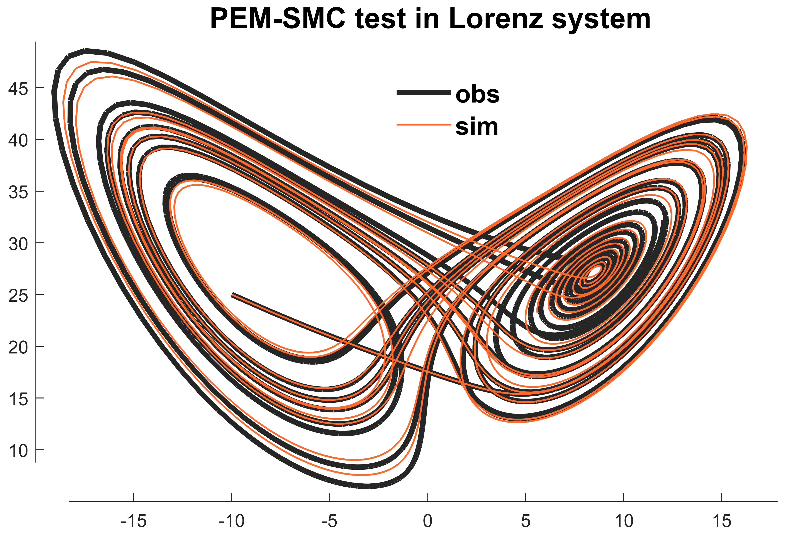

# PEM-SMC
##### Particle Evolution Metropolis Sequential Monte Carlo (PEM–SMC) algorithm

Here we tested the performance of the PEM-SMC algorithm with an extremely sensitive model: the Lorenz system. The PEM-SMC could successfully find the optimal parameters with the target function. 

Please find the details in our published paper here:

> Zhu, G., Li, X., Ma, J., Wang, Y., Liu, S., Huang, C., Zhang, K., and Hu, X. (2018). A new moving strategy for the sequential Monte Carlo approach in optimizing the hydrological model parameters. Advances in Water Resources *114*, 164–179. [Link](https://www-sciencedirect-com.eproxy.lib.hku.hk/science/article/pii/S0309170817300155)

